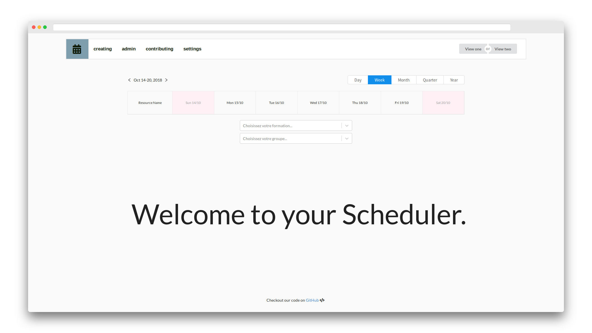

React-Big-Scheduler Interface
============
[](https://github.com/aenkirch/React-Big-Scheduler-Interface) []()

This is a React/Node.JS app which uses the <a href="https://github.com/StephenChou1017/react-big-scheduler">React-Big-Scheduler project</a> in order to display a scheduler related to a university class which you can select in a list : it also offers some more features like adding events on it, etc...



---
## Some context

This project was developed during a few months as a school project for Paris Descartes University : therefore, the database used on the demo was provided by our teacher.


---

## Features

<ul>
    <li>Selection of the training program and group to show the scheduler</li>
    <li>Drag-and-drop to move an event, save or delete event with live action on the DB</li>
    <li>Add a training program, group, event, subject, unit using forms</li>
    <li>Confirmation of done action or error if one happened on DB displayed on a toast</li>
    <li>Show infos on events displayed on the scheduler</li>
    <li>Handles the conflict between two events if happening at the same time</li>
</ul>

---

## Technologies used

**Back-end** : Node.JS <br />
**Front-end** : React w/ Redux <br />
**Database** : MySQL <br />

---

## Setup

First, make sure you have installed MySQL and Node.JS on your computer.
If so : now install yarn by typing `npm install yarn`.

Now, go into the project folder and type `yarn install` to install the missing dependencies of the server side of the project, type `yarn install` again in the `client` folder to install the missing dependencies of the client side of the project.

Then, install the database by importing the `.sql` file in the project folder, go into the `server.js` file and at `line 13`, type the username, password, the name, and the port you gave to your database.

```
    // Create connection
    const db = mysql.createConnection({
        host: 'localhost',
        user: 'root',
        password: 'password',
        socketPath: '/var/run/mysqld/mysqld.sock', //   comment out this line on non-Linux systems
        port: 3306,
        database: 'nodemysql_test'
    });
```


---

## Usage

<strong>yarn dev</strong> : type this command line when you've finished the setup section, it runs the server side of the project and the client side of the project at the same time to run the full app

<strong>yarn start</strong> : if you type this command line when you're either in the `/` folder of the project, it will run the server side of the project only, if you run it in the `/client` folder of the project, it will run only the client side of the project

---

## Structure of the project

The project is split in two parts : the **root** directory which is opened on the server side and the **client** directory which is opened on the client side.

Files opened on <strong>server side </strong> offer a REST API which communicates with the mySQL server : this REST API offers basic CRUD (Create/Read/Update/Delete) services.

Files opened on <strong>client side </strong> offer an interface in order for the user to launch actions on the database or just in order to see the scheduler.

---

## Some errors fixes

**EADDRINUSE** : **killall node** will fix this error, may happen if you opened unintentionally two instances of the project

---

## Credits

Thanks to StephenChou1017 for the scheduler component he made and for his help during this project development !

Thanks to our teacher Jean-Michel Ilié for giving us such a project which allowed us to learn a lot of the technologies we used to develop this project !

And of course, thanks to every person who helped us during this project and to every person who developed a package we used in this project, it's all because of you ;)

---

## License

This project is licensed under the terms of the MIT license.